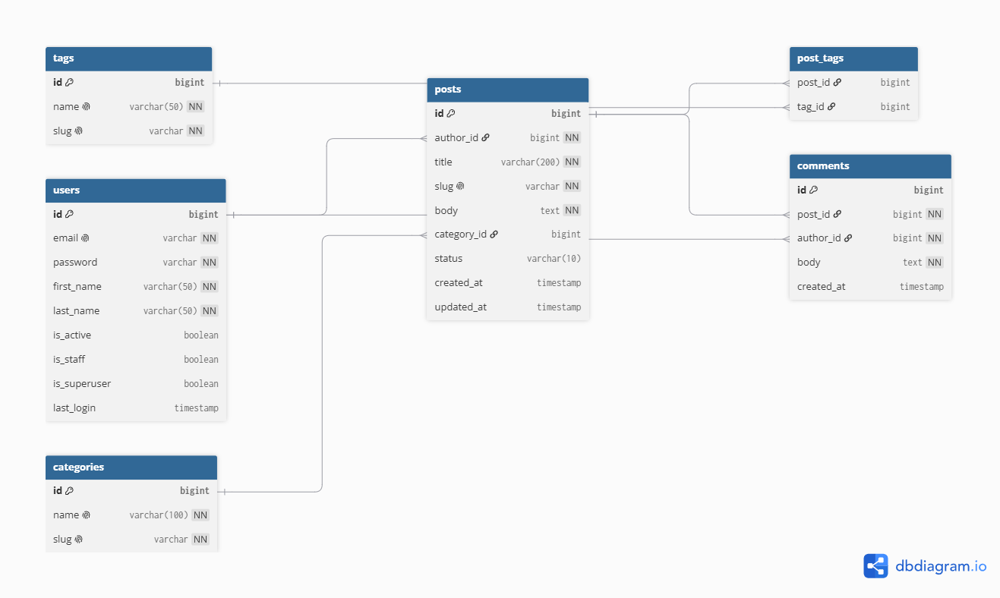

# blog-api

Blog REST API built with Django and Django REST Framework.

## ERD



## Apps

- **auths** — custom user model (login by email), JWT authentication
- **blog** — posts, comments, categories, tags

## Setup

```bash
python -m venv venv
venv\Scripts\activate
pip install -r requirements/dev.txt
```

Create `settings/.env`:

```
BLOG_ENV_ID=local
BLOG_SECRET_KEY=your-secret-key
BLOG_ALLOWED_HOSTS=localhost,127.0.0.1
```

Run:

```bash
python manage.py migrate
python manage.py createsuperuser
python manage.py runserver
```